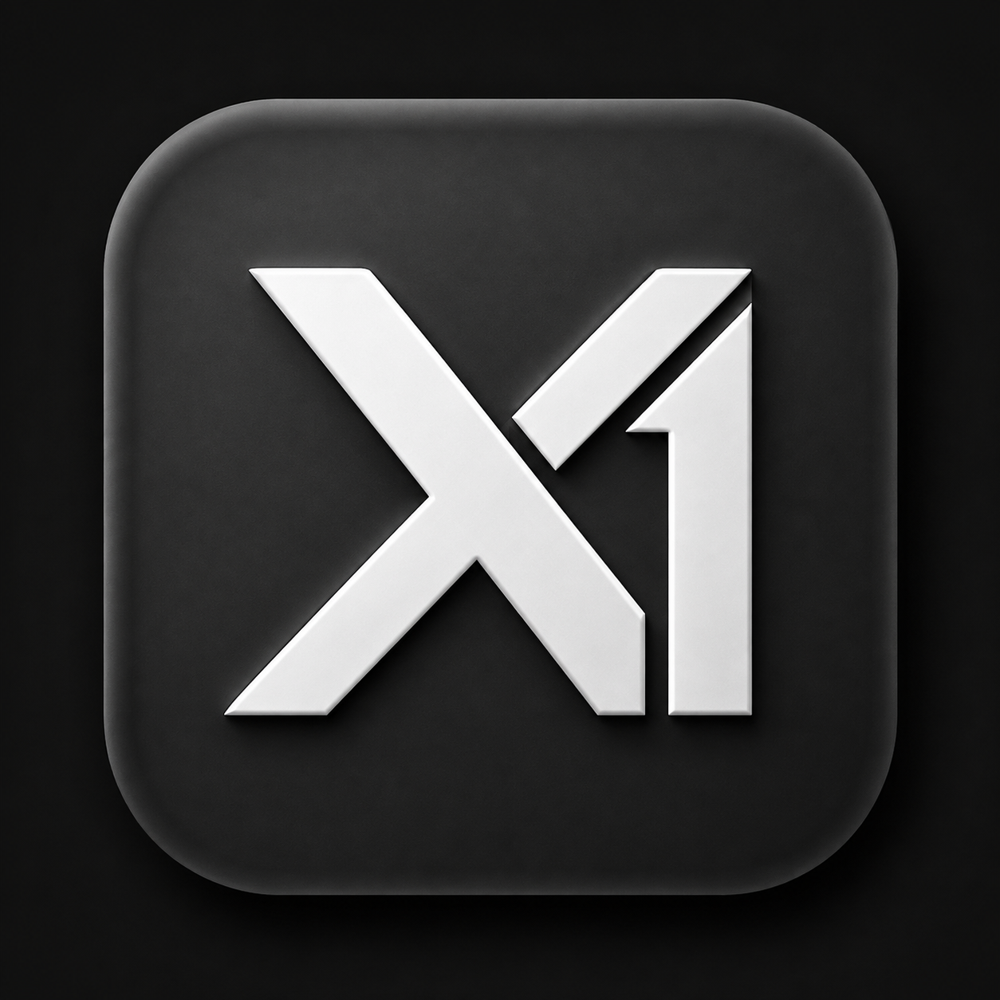
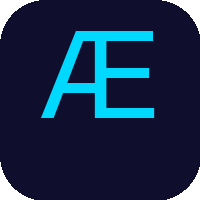

## About

I build AI-first products, system-level experiences, and scalable digital platforms with a product mindset. My work sits at the intersection of AI, software architecture, developer experience, and full-stack product design.

I enjoy creating tools that feel useful in the real world: clearer workflows, smarter systems, and better decisions powered by technology.

  
  
  

## Recent GitHub & Product Work

### Live Products

&nbsp;&nbsp;&nbsp;&nbsp;

&nbsp;&nbsp;&nbsp;&nbsp;

&nbsp;&nbsp;&nbsp;&nbsp;

### GitHub Repositories

## Current Focus

## Connect

## GitHub Stats

## Tech Stack

### AI & ML

### Frontend & Product Experience

### Backend & API Engineering

### Data, Search & Storage

### Cloud, DevOps & Delivery

### Product, Workflow & Systems

## Note

I am building products that are useful, thoughtful, and public-facing. The focus is on clarity, thoughtful execution, and creating tools that improve how people work, learn, connect, and decide.

